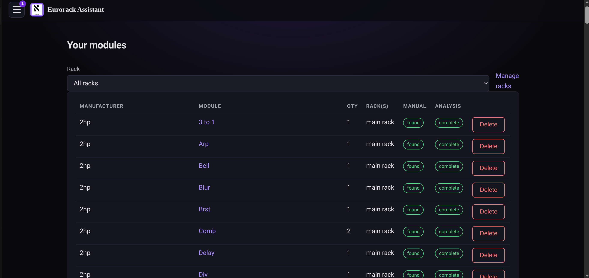

# Eurorack Assistant

An open-source web application for asking LLMs questions about **your** eurorack
modular synthesizer system. Import your module list, and the app automatically
finds each module's user manual, analyzes it into a structured description
(summary, jacks with voltage ranges and polarity, buttons, toggles, …), and then
answers your questions using the actual manuals as context.

It is the web version of the [eurorack-processor](https://github.com/nstarke/eurorack-processor)
scripts: manual research, download, analysis, and question answering are ports
of `find_manuals.py`, `process_manuals.py`, and `ask.py`.



## Features

- **Multi-user**: an admin account (created at setup with a one-time random
  password) can create regular user accounts. Each user has their own system
  (module mappings, quantities, questions); the module records themselves —
  manuals and analyses — are shared, so a module researched once benefits every
  user who has it. Users can also attach additional private PDF documents to
  their own module instances.
- **Import** your modules three ways: newline-delimited free text
  (`Make Noise Maths` or `Make Noise,Maths`), a README.csv-style CSV, or a
  ModularGrid rack URL (module names only — everything the app records about a
  module is taken from its manual or its manufacturer's product page). A list
  may state each module's panel width: a CSV with a header row can carry an
  `hp` column, and a width written after a name (`Maths 20HP`) is read off it.
  Whatever the list does not say is filled in from the manual when it is
  analyzed.
- **Fully asynchronous pipeline** with live progress over a WebSocket:
  1. `import` job — parses the list and creates module records
  2. `find_manual` job (per module) — LLM web research finds the official
     manual PDF, downloads and validates it (archive.org fallback)
  3. `analyze_manual` job (per module) — the LLM reads the manual and returns a
     structured summary plus every component (input/output jacks with voltage
     ranges and unipolar/bipolar polarity, knobs, buttons, toggles, switches, …)
     stored with a `type` field
  4. `panel_image` job (per module) — finds the module's front plate and puts
     every analyzed component on it (see below)
  5. `extract_manual` job (per document) — poppler's `pdftotext` reads the PDF
     and the structure heuristics in `services/manualText.js` turn it back
     into markdown (headings, lists, paragraphs; running headers and page
     numbers dropped), stored for reading and full-text search (see below). No
     model runs unless the PDF turns out to be a scan with no text layer at
     all, so it costs nothing for almost every document — it is queued
     alongside the analysis rather than behind it.

  Gaps in all of that can be filled from the modules page ("Fill in missing
  details"): every module with no manual, no analyzed components, no panel
  picture, no HP width or no extracted text is queued for the one step that
  would supply it, and
  the modules that already have everything are left alone — redoing a complete
  analysis costs a model run per module and overwrites corrections made by
  hand. Re-discovering the manuals is an off-by-default option, for a module
  whose analysis is missing because the document found for it was the wrong
  one. "Rebuild every panel" is the same escape hatch for the panels: it sends
  every analyzed module back through `panel_image` even if it already has one,
  which is what to reach for when how panels are built has changed (nothing
  about a module itself ever says its markers were placed by older code). A
  panel picture you uploaded survives it — the job keeps the image and only
  works out its markers again.

  Each attempt of a job gets a time limit of 45 minutes, widened by the
  attempt count (45, then 90, then 135) — work that timed out because it is
  genuinely long would otherwise fail identically on every retry.
- **Front panels**: each module gets a picture of its front plate with its
  jacks and controls located on it. The panel image is researched on the web —
  the manufacturer's product page or a retailer's first, and ModularGrid only
  if neither has one, since it is a rack planner whose pictures are contributed
  rather than published. The LLM then marks where each analyzed component sits
  on it. When no usable photograph exists — or the one found turns out not to
  show this module straight on — the LLM reads the panel LAYOUT out of the
  manual instead (how many HP wide, where each control sits) and the server
  draws that as an SVG. Either way every jack ends up with a position, which is
  what makes the patch diagram possible.

  Where a photograph is used, what the model says about it is then **measured
  against the pixels** (`services/panelPixels.js`), because a model reading a
  photograph is reliable about which control it is looking at and only roughly
  right about where it is — measured over the first panels captured here, every
  marker landed about 2% of the panel's height low, dragged towards the
  silkscreened name printed under its control. So: the front plate is found by
  trimming the photograph's backdrop rather than by asking; the model is shown
  that crop rather than a module 4% of the way across a press shot; and every
  round component it places is finally snapped onto the most convincing
  circular feature near it, with whatever the snapped markers moved by carried
  into the LEDs and toggles too flat to snap. That took the error on those
  panels from 2.8–3.1mm RMS to 0.35–0.75mm. All of it degrades quietly: an
  image that cannot be decoded just keeps what the model said.

  Three rules keep "the most convincing feature near it" from being a licence
  to grab the wrong thing, each of them there because it was needed:

  - **A piece of hardware has one thing in its middle.** A jack's hole is
    black, a knob's cap dark; lettering and a maker's logo are ink and bare
    plate alternating, which averages out darker than the plate and reads as a
    dark round thing on contrast alone. Scoring the *unevenness* of the middle
    as well as the surround separates the two completely — on the 2hp 3:1 every
    jack scores 106 or better and the knob 87, while the "OUT" silkscreen, the
    "2hp" logo and both mounting slots fall under the floor entirely.
  - **The search reaches past the neighbouring control, and travel costs
    score.** A model that has lost count rather than drifted puts a marker a
    whole component away, further than any window tight enough to exclude the
    neighbour. So the window is wide and the nearest plausible hardware wins
    unless something further off is markedly more convincing.
  - **No two markers may claim the same hole**, since a panel has one marker
    per hole. The weaker claim is made to look again at what is left.

  What could not be snapped is corrected by **interpolating between the
  hardware above and below it** rather than by one median shift for the whole
  panel, so an error that grows as the model works down the panel is followed
  instead of averaged away.

  When it still lands wrong, **drag the marker onto the hardware it names** on
  the module page; it saves where you drop it. Resting on a marker says which
  control it is and what the manual says it does. A hand-placed marker lasts
  until the panel is rebuilt (a new upload, a re-analysis, "rebuild every
  panel"), which is also what puts markers back when re-analysis renumbers
  every component.

  One thing the panel job deliberately does **not** treat as an answer: a
  provider that is not answering. Plenty of modules genuinely have no findable
  photograph, and the drawn panel is the right result for those — but an
  expired login or an exhausted quota fails every call in the job identically,
  and read as "found nothing" it would replace every photographed panel in a
  rack with a column of circles and delete the photographs as orphans. So the
  job counts how many of its model calls came back readable, and if none did it
  fails instead, leaving the panel the module already has exactly where it is.

  You can also **upload your own panel picture** from the module page (PNG,
  JPEG, GIF or WebP). An uploaded panel replaces whatever the module had and is
  never replaced by research afterwards: the `panel_image` job is queued to
  locate this module's components on your picture instead, which is also what
  puts the markers back after a re-analysis. Remove it and the module goes back
  to a researched or drawn panel. Like the manual, the panel belongs to the
  shared module record, so everyone with that module racked sees it.
- **Searchable manuals**: every manual is also kept as text. The
  `extract_manual` job reads the PDF with `pdftotext` and rebuilds it as a
  markdown document — headings, lists and paragraphs recovered from line
  layout, words rejoined across line breaks, the header and page number
  repeated on every page dropped — stored in `manual_documents` behind a
  postgres GIN full-text index. No model runs, which is what makes it
  affordable to do for every document the app holds.

  Some manuals are scans, though: page images with no text layer, which no
  amount of structure recovery can read. Those (and any PDF poppler refuses
  outright) fall back to asking the LLM provider to transcribe the pages —
  the one thing the deterministic path cannot do at any price. It is a
  fallback and not the method: it fires only where `pdftotext` came back
  empty, and `manual_documents.source` records which of the two produced the
  text (`pdftotext` or `llm`). `extract_manual` therefore takes a model
  override of its own in the admin config, so the transcription can be pointed
  at a cheap model.

  The **Search manuals** page searches all of it at once: bare words, `"quoted
  phrases"` and `-exclusions`, ranked, each hit showing the matched words in
  context and linking to the module it belongs to. What you can search is
  exactly what you can read: the shared manuals of every module, plus the
  documents *you* uploaded — an upload is searchable and readable by its owner
  alone, never by other users.

  Each document can also be **read as a page** rather than opened as a PDF
  (rendered from the markdown, with the source and a `.md` download a click
  away) — linked from the module page's Documents table and from every search
  hit.
- **Patch diagram**: a patch is drawn as the modules it uses, panel beside
  panel, with a coloured cable curving between the jacks each patch cable
  joins. Only the modules the patch actually touches are drawn (a patch
  snapshots the whole rack), optional cables are dashed, and a jack the panel
  could not place is shown in a strip under it rather than guessed onto the
  picture.
- **Ask questions**: the LLM first decides which of your modules — and which
  specific components — the question applies to, then you review that scope
  before the answer is generated: add or remove modules and components, and
  choose what to attach (each module's manual is preselected but can be
  deselected, plus your uploaded documents, previous answers, notes tied
  to the selected modules/components, oscilloscope captures, and your patches).
  Questions, answers, the reviewed scope, and the attachments are all stored
  and linked in the database.
- **LLM provider is admin-configurable** in the web UI: Claude Code CLI
  (`claude -p`) or Codex CLI (`codex exec`), with an optional model override —
  both use your existing subscription login, no API key needed.
- **Patches**: record a patch against a snapshot of a rack — the cables, how
  every control is dialed in, what each instance is doing in this patch
  ("LXR #2 — ghost layer") and which bus or layer it belongs to. The snapshot
  keeps rendering after modules move racks, get re-analyzed or are deleted.
- **Fast patch entry**: every end of a cable is found by typing — arrow keys
  move through the matches, Enter takes one and moves to the next field —
  or the whole cable on one line (`maths eor > optomix ch1 in`), resolved as
  you type and never guessed when the words match more than one jack. Inputs
  that already have a cable in them are shown as such instead of being offered
  and refused; a cable can be reused as the starting point for a variant or
  turned around where both jacks allow it; "chain" mode starts the next cable
  where the last one landed; and a whole patch can be duplicated as the
  starting point for its next version.
- **What to patch next**: every cable in your other patches is reduced to
  (module, jack) → (module, jack), counted, and offered here when both ends
  are free — a rack is patched in habits. Modules that receive signal and send
  none are listed as loose ends.
- **Signal flow**: patches are traced, not just listed. The analysis records
  each module's internal signal paths, normalled connections, routing switch
  sections, mult groups and stereo pairs, and the patch view follows every
  signal from its source through cables, mult copies, defaults, switches and
  module internals to everywhere it ends up — flagging splits, merges,
  feedback loops and paths that are only one of several alternatives. Only the
  modules the patch actually uses are traced — and the same goes for the
  normalled connections it lists: a patch snapshots the whole rack, but a
  module nothing is plugged into (and whose controls the patch does not dial
  in) is not part of the patch.
- **Ask about a patch**: a question can name one of your patches — from the
  Ask page or the "Ask about this patch" link on the patch itself. The patch is
  attached to the question as a document of its cables, control settings, the
  normalled connections it leaves intact or cancels and the signal flow they
  add up to, and the modules it uses are put in scope with their manuals.
- **Hardware that doesn't fit one panel**: connections that are not 3.5mm
  patch points (MIDI DIN/TRS, USB, S/PDIF, mics, ethernet) are typed as such
  and only patch into their own kind; expander panels joined by ribbon cable
  are declared on the module so signal traces across the pair; bridged pairs
  carry signals between two points of a system; and off-rack gear (a DAW, a
  MIDI interface, the PA) and modules the rack does not hold take part in a
  patch with connection points declared inside it.
- **Paths that depend on a setting**: a switch that chooses which signal is
  normalled to an input, or turns an output from a channel pass-through into a
  mix, is recorded with the control position it needs. Alternatives are shown
  as a selection rather than as signals summing, and recording the switch's
  position in a patch resolves the flow.
- **Private notes**: attach notes to modules, to specific components and to
  patches; a note can be reused across any number of them and is private to
  you until you share it.
- **Sharing**: a note, a patch, a question and its answer, a whole rack, or a
  document you uploaded can be shown to one other user, to several, or to
  everyone (including users added later). Sharing grants reading and nothing
  else — the owner stays the only one who can change or delete what they made,
  and clearing the recipient list takes it back. The Share button sits on each
  record and says who can currently see it; the **Shared** page lists both
  what other people have given you and what you have given out. A shared
  document also appears on the module page of whoever received it, credited to
  whoever sent it, and joins their manual search.
- **Oscilloscope integration**: an oscilloscope application (such as
  [CVOsc](https://github.com/aleph-void/CVOsc.com)) links itself to your
  account with an OAuth 2.0 device code you approve in the browser, then holds
  a WebSocket open. With a scope connected, a patch maps its channels to the
  jacks of the audio interface in it — an ES-9's inputs are matched and named
  after whatever the patch cables into them — and you can ask the scope for a
  waveform image and the tuner reading taken with it. Captures are filed under
  the patch's notes and can be attached to a question, so the LLM sees the
  measurement alongside the manuals. See
  [docs/oscilloscope-protocol.md](docs/oscilloscope-protocol.md).
- **Job privacy**: background jobs (and their live progress) are visible only
  to the user who triggered them (admins see all jobs). Shared module state
  still benefits everyone.
- **Out of tokens stops the queue**: when the provider CLI reports that the
  subscription is exhausted, the whole queue is paused rather than every job
  behind it burning three attempts on the same wall. The job that hit it goes
  back on the queue with its attempt refunded, the jobs screen says so, and
  the queue starts again by itself at the reset time the provider named (an
  hour, if it named none) or when anyone presses Resume Now.

## Quick start

```sh
./setup.sh
```

The setup script does everything (Ubuntu is the supported target for automatic
installation; on other distros install Docker yourself first):

1. installs `docker.io` + `docker-compose-v2` via apt if missing,
2. installs the `claude` and `codex` CLIs if missing,
3. asks which LLM provider you want and walks you through logging in
   (Claude Pro/Max subscription for Claude Code, ChatGPT for Codex),
4. generates `.env` (random database password), builds the images, migrates
   the database, and
5. creates the `admin` account — **its random password is printed once during
   setup and stored only as a bcrypt hash**. The admin must set their own
   password at the first login.

The app is then at <http://localhost:8080>.

### HTTPS

Pass your domain to the setup script to serve TLS on port 443:

```sh
sudo certbot certonly --standalone -d rack.example.com   # if you don't have certs yet
./setup.sh rack.example.com
```

When certs exist in `/etc/letsencrypt/live/<fqdn>/`, nginx serves
<https://fqdn/> on port 443 with port 80 redirecting to it (the FQDN is
remembered in `.env`, so later plain `./setup.sh` runs keep TLS). Certs are
mounted read-only from the host; after a `certbot renew`, reload nginx with
`docker compose exec nginx nginx -s reload` (a good certbot deploy hook).
With rootless Docker, setup grants `rootlesskit` the `cap_net_bind_service`
capability so it can bind ports 80/443.

The server container mounts `~/.claude` and `~/.codex` from the host so the
CLIs inside the container reuse your subscription logins (override the paths
with `CLAUDE_CONFIG_DIR` / `CODEX_CONFIG_DIR` in `.env`).

Useful afterwards:

```sh
docker compose logs -f server   # watch the job worker
./reset-admin-password.sh       # new random admin password (printed once; forces a change at next login)
docker compose down             # stop (data persists in volumes)
```

## Architecture

```
browser ── nginx (:8080) ──┬── static Vue 3 client (built at image build time)
                           └── /api → Express server (:3000)
                                        ├── PostgreSQL (modules, components,
                                        │   questions, answers, jobs, users)
                                        ├── job worker (import / find_manual /
                                        │   analyze_manual / panel_image /
                                        │   extract_manual / scope_question /
                                        │   answer_question)
                                        ├── /api/ws WebSocket (live job progress
                                        │   and oscilloscope presence)
                                        ├── /api/devices/ws WebSocket (connected
                                        │   oscilloscope apps, request/response)
                                        └── claude -p / codex exec (LLM calls)
```

- `server/` — Express (ESM). Routes in `src/routes/`, LLM/domain logic in
  `src/services/`, the queue worker in `src/jobs/worker.js`. Sessions are
  httpOnly cookies backed by a `sessions` table; passwords are bcrypt hashes.
- `client/` — Vue 3 + Pinia + Vue Router (Vite). Live job progress arrives over
  the WebSocket and feeds the Jobs page, the Import page, and the badge on the
  menu button. Navigation lives in a hamburger drawer, styling follows the
  Aleph Void palette in `src/style.css`, and the long detail pages (module,
  patch, question) keep each section behind a click-to-open expander.
- Database schema is created by `server/migrations/*.sql`, applied
  automatically at server start (tracked in `schema_migrations`).

### Data model (main tables)

| table | purpose |
| --- | --- |
| `users` | accounts; `is_admin` flag |
| `modules` | **shared** module records with `manual_status` / `analysis_status` / `panel_status` — the manual is found, analyzed and drawn once, for everyone |
| `racks` | a user's named racks (unique name per user, `main rack` by default); strictly private to their owner |
| `rack_modules` | maps racks to the modules in them (per-rack quantity); "deleting" a module only unlinks it, and the same module can sit in many racks |
| `manuals` | PDF documents mapped to modules — `user_id NULL` is the shared auto-found manual; rows with a `user_id` are private documents that user attached to their own module instance |
| `manual_documents` | each document's text as markdown (`pdftotext` + the structure heuristics in `services/manualText.js`), with a GIN index on `to_tsvector('english', content)` — one row per `manuals` row, inheriting its visibility: `user_id NULL` is a shared manual's text, a `user_id` is that user's upload and is searchable by them alone |
| `module_components` | typed components (`input_jack`, `output_jack`, `bidirectional_jack`, `knob`, `slider`, `button`, `toggle`, `switch`, `display`, `other`) with `voltage_min`/`voltage_max`/`polarity`, a mult `group_label`, and `port_kind` for connections that are not 3.5mm patch points (`midi_din`, `usb`, `microphone`, …) |
| `module_panels` | the module's front plate: a photograph found on the web (`source` `image`) or the logical panel drawn from its manual (`generated`), stored content-addressed under `PANELS_DIR`, with the box of the image the panel occupies |
| `module_panel_components` | where each analyzed component sits on that panel, as fractions of the image — what the patch diagram draws cables between |
| `component_values` | the valid settings of a control: a `min`/`max` pair, or one `enum` row per discrete position |
| `component_routes` | module-internal signal paths (input jack → output jack) — what carries flow across a module; an output no route feeds is a signal generator |
| `component_normalizations` | default connections that hold until something overrides them, with what breaks them (`break_component_id` + `break_on`, for outputs normalled to outputs) |
| `component_switches` / `component_switch_steps` | routing switch sections: a common jack connected to exactly one step jack at a time |
| `component_pairs` | two jacks carrying the two halves of one signal (stereo L/R) |
| `module_expanders` | a host module and an expander panel joined by a ribbon cable, so routes and normals may cross between them |
| `module_path_hints` | what a manual said that could not be stored yet — a signal path running to another panel, or the name of an expander whose record does not exist or is not linked. Materialized whenever resolution becomes possible (the other panel is analyzed, or the two are linked), and kept afterwards so re-analyzing that panel does not lose the paths again |
| `patches` | a patch against a snapshot of a rack (module/component references are soft, so the snapshot survives changes to the rack) |
| `patch_modules` | one row per module instance in the patch, with its `label`, bus (`group_id`) and an `external` flag for off-rack gear |
| `patch_module_ports` | connection points declared inside the patch, for instances with no analyzed module behind them |
| `patch_cables` | a cable between two jacks, plus `note`, `optional`, `stacked` and `alt_group` |
| `patch_settings` | how a control is dialed in for this patch — and what resolves paths that depend on a switch position |
| `patch_groups` | named buses / layers within a patch |
| `patch_module_links` / `patch_module_link_jacks` | instances wired together without patch cables: `expander` pairs and `bridge` pairs (jack N ↔ jack N) |
| `notes` | per-user private notes |
| `note_modules` / `note_components` / `note_patches` | attach one note to any number of modules / components / patches |
| `shares` | one record (`note`, `patch`, `question`, `rack` or `document`) readable by one other user — or by everyone, when `user_id` is NULL |
| `oauth_clients` | applications allowed to obtain a device token (public clients; `cvosc` is seeded) |
| `device_authorizations` | in-flight device-grant codes: the hashed device code, the short user code, and whether the user approved it |
| `device_tokens` | issued device credentials (access + refresh stored as sha256 hashes), revocable from the web UI |
| `patch_scope_channels` | which scope channel watches which jack of which module instance, per patch — derived from the patch, overridable by hand |
| `captures` / `capture_channels` | a waveform image (content-addressed PNG under `CAPTURES_DIR`) and the tuner reading taken with it, per channel |
| `questions` | prompt, answer, status, error |
| `question_modules` | links a question to the modules in scope (LLM-suggested, then user-reviewed) |
| `question_components` | links a question to the specific components it pertains to (LLM-suggested, then user-reviewed) |
| `question_manuals` / `question_answers` / `question_notes` / `question_captures` | the documents the user attached during review: manual PDFs, previous answers, notes, oscilloscope captures |
| `question_patches` | the patches a question is about — the patch rides along as a document of its cables, settings, normalled connections and signal flow, and the modules it uses go into scope |
| `jobs` | the async queue (`import`, `find_manual`, `analyze_manual`, `panel_image`, `extract_manual`, `scope_question`, `answer_question`) with attempts + errors |
| `app_config` | admin-set LLM provider/model (globally and per job type via `llm_model_<job_type>`), job worker count (`import_workers`, default 4), and the queue pause the worker sets when the provider runs out of tokens (`queue_paused_until`, `queue_paused_reason`) |

## Development

Server (Node 20+):

```sh
cd server
npm install
npm test          # vitest + supertest + pg-mem (no database needed)
npm start         # needs DATABASE_URL or POSTGRES_* env vars
```

Client:

```sh
cd client
npm install
npm test          # vitest + vue test utils
npm run dev       # dev server on :5173, proxies /api to :3000
```

Tests never call real LLMs or the network — the CLI backends, `fetch`, and the
database are all injected fakes (`pg-mem` in-memory Postgres for the server).

## Security notes

- The admin password is generated with `crypto.randomBytes` at setup, printed
  once, and stored only as a bcrypt hash. Same for generated user passwords.
- Accounts with a pending forced password change (the admin after setup or a
  reset, any user after an admin password reset) are locked out of every API
  endpoint except the change-password form until they set their own password.
- Users change their own password (current password required) via the username
  link in the nav; admins can reset any other user's password without it.
- Only admins can create users (always non-admin) and change the LLM config.
- Each user sees only their own module mappings, questions, notes, uploaded
  documents, captures, and jobs (admins see all jobs), plus whatever another
  user has explicitly shared with them.
- A share grants reading only, and only of the record it names. Managing a
  share is the owner's alone: a recipient cannot re-share, edit or delete what
  they were given, and a record somebody else owns and has not shared answers
  404 — the same answer as one that does not exist.
- LLM answers are rendered as markdown sanitized with DOMPurify.
- An oscilloscope never sees a password: it gets a token only after the user
  approves its short code in an already-authenticated browser session. Device
  tokens are stored as sha256 hashes, carry a single `oscilloscope` scope, are
  refreshed with rotation (both halves change on every refresh), and are never
  accepted by the session-authenticated routes. Revoking one in the web UI also
  drops the socket it has open.
